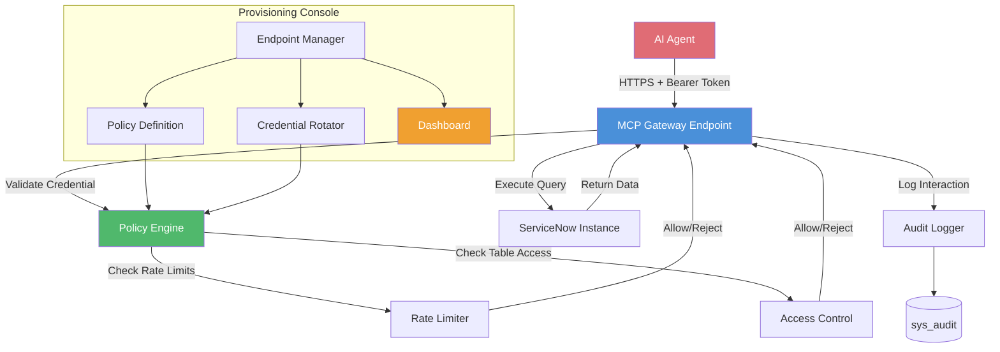

# MCP Server Console Provisioner (MCPE)

**Scope Prefix:** `x_mcpe`
**Repository:** `vladarchitectservicenow-oss/MCPE`
**License:** [](https://www.gnu.org/licenses/agpl-3.0)
**Author:** Vladimir Kapustin

---

## Overview

MCP Server Console Provisioner is an enterprise-grade ServiceNow scoped application that securely provisions and governs Model Context Protocol (MCP) server endpoints within ServiceNow, enabling AI agents to access instance data through governed, auditable connections. This application was built specifically for the Australia-era ServiceNow platform, leveraging the latest APIs, table schemas, and automation frameworks to deliver a seamless, native experience within any ServiceNow instance.

As organizations deploy AI agents that need to interact with ServiceNow data — reading incident queues, querying CMDB records, executing catalog items — the security and governance gap becomes acute. AI agents need controlled data access with audit trails, rate limits, and scoped permissions. MCPE fills this gap by acting as the provisioning console: it registers MCP server endpoints, enforces access policies, rotates credentials, and logs every agent interaction for compliance.

Unlike ad-hoc API token generation or hardcoded service accounts, MCPE provides a structured lifecycle for MCP server endpoints: create → activate → monitor → rotate → revoke. Every operation is logged to `sys_audit`. Rate limits prevent agent-induced instance overload. Role-based access controls ensure agents only see the data their scope permits.

---

## Problem Statement

Enterprise AI adoption creates a new class of integration risk. When an AI agent — whether a coding assistant, a ChatOps bot, or an autonomous workflow engine — needs to interact with ServiceNow, the traditional approaches are inadequate:

1. **Service Account Sprawl** — Teams create ad-hoc service accounts with broad `snc_read_only` or ITIL roles, exposing far more data than the agent needs
2. **No Visibility** — Once a service account token is issued, there is no mechanism to monitor what the agent is actually querying, at what rate, or whether it's accessing sensitive data
3. **Credential Staticity** — Tokens sit in config files or environment variables for months, violating rotation policies and creating a long-lived attack surface
4. **No Rate Limiting** — Agent-initiated queries can spike instance load with unpredictable patterns that traditional user-based throttling doesn't catch

MCPE solves all four by treating MCP server endpoints as first-class governed resources within the ServiceNow security model.

---

## Core Features

1. **Endpoint Lifecycle Management:** Register, activate, suspend, and revoke MCP server endpoints through a governed workflow. Each endpoint gets a scoped service account, a time-limited credential, and a policy profile.

2. **Policy Enforcement:** Define per-endpoint policies for rate limits (requests/minute), table access (allowlist/denylist), data sensitivity filters (mask or exclude HR/financial data), and time-of-day access windows.

3. **Credential Rotation:** Automated rotation schedules configurable per endpoint (daily, weekly, monthly). Old credentials are revoked on rotation. Integration with ServiceNow Credential Resolvers for secure storage.

4. **Audit Logging:** Every agent interaction is logged to `sys_audit` with endpoint ID, timestamp, queried tables, row count, and response time. Dashboard shows agent activity trends, anomaly detection, and policy violation alerts.

5. **Rate Limiting Engine:** Per-endpoint and global rate limiters with configurable burst tolerance. Rate-limited requests return HTTP 429 with `Retry-After` headers, preventing agent-driven instance overload.

6. **REST API for Agent Registration:** Agents register themselves via a REST API (`POST /api/x_mcpe/register`), submitting their intended scope and use case. The provisioning workflow auto-generates a policy profile and returns credentials.

7. **Dashboard and Reporting:** Real-time dashboard showing active endpoints, request volumes, policy violations, and credential expiry timeline. Weekly digest emails to Security Operations.

8. **Multi-Instance Federation:** (Planned v1.2) Manage MCP endpoints across dev, test, and production instances from a single console with consistent policy propagation.

---

## Architecture



### Component Descriptions

| Component | Script Include | Responsibility |
|-----------|---------------|----------------|
| **Endpoint Manager** | `MCPEndpointManager` | CRUD operations for MCP endpoints, policy attachment, credential issuance |
| **Policy Engine** | `MCPPolicyEngine` | Runtime evaluation of rate limits, table access, time windows, data filters |
| **Rate Limiter** | `MCPRateLimiter` | Token-bucket algorithm per endpoint, burst tolerance, 429 response generation |
| **Credential Rotator** | `MCPCredentialRotator` | Scheduled credential rotation, revocation, Credential Resolver integration |
| **Audit Logger** | `MCPAuditLogger` | Structured logging to `sys_audit`, anomaly detection, weekly digests |
| **Gateway** | `MCPGateway` | REST endpoint (`/api/x_mcpe/gateway`) — entry point for all agent queries |

### Data Model

| Table | Purpose | Key Fields |
|-------|---------|------------|
| `x_mcpe_endpoint` | Registered MCP endpoints | `name`, `agent_id`, `status` (active/suspended/revoked), `policy_profile`, `credential_sys_id`, `created_by`, `last_rotated` |
| `x_mcpe_policy` | Access policy definitions | `name`, `rate_limit_rpm`, `table_allowlist`, `table_denylist`, `sensitivity_filter`, `time_window_start`, `time_window_end` |
| `x_mcpe_request_log` | Per-request audit trail | `endpoint_sys_id`, `timestamp`, `queried_table`, `row_count`, `response_time_ms`, `disposition` (allowed/blocked/rate_limited) |
| `x_mcpe_credential` | Managed credentials | `endpoint_sys_id`, `credential_type`, `rotation_interval_days`, `last_rotated`, `expires_at` |

### Data Flow

```
AI Agent → POST /api/x_mcpe/gateway (Bearer Token)
    → Gateway validates token against x_mcpe_credential
    → Policy Engine checks rate limits + table access
    → Query executes against target table
    → Result returned to agent
    → Audit Logger records interaction to x_mcpe_request_log
```

---

## Installation and Setup

### Prerequisites

- ServiceNow instance (Australia or later)
- `admin` role for initial installation
- Node.js 18+ (for local test harness)

### Step 1: Clone and Import

```bash
git clone https://github.com/vladarchitectservicenow-oss/MCPE.git
cd MCPE
```

1. Navigate to **System Applications > Studio** in your ServiceNow instance.
2. Click **Import from Source Control**.
3. Enter the repository URL and your credentials.
4. ServiceNow Studio will build the scoped application `x_mcpe`.

### Step 2: Configure Base Policy

1. Navigate to **MCPE > Policies**.
2. Create a default policy profile with appropriate rate limits (start with 60 RPM).
3. Define table allowlists (e.g., `incident`, `change_request`, `cmdb_ci` for ITSM use cases).

### Step 3: Register First Endpoint

```javascript
var manager = new MCPEndpointManager();
var endpoint = manager.register({
    name: 'SlackOpsBot',
    agent_id: 'bot-slack-001',
    policy_profile: 'default',
    rotation_interval_days: 30
});
gs.info('Endpoint created: ' + endpoint.sys_id);
gs.info('Bearer Token: ' + endpoint.credential);
```

### Step 4: Configure Scheduled Rotation

Navigate to **MCPE > Scheduled Jobs** and activate the credential rotation job. Default cadence is daily at 02:00 UTC.

---

## Usage Guide

### Agent-Side Integration

Agents authenticate via Bearer Token in the `Authorization` header:

```bash
curl -X POST https://YOUR_INSTANCE.service-now.com/api/x_mcpe/gateway \
  -H "Authorization: Bearer mcp_7a3f9b2c..." \
  -H "Content-Type: application/json" \
  -d '{"action": "query", "table": "incident", "query": "active=true^priority=1"}'
```

### Dashboard Monitoring

From the application navigator, open **MCPE > Dashboard** to see:
- Active endpoint count and status
- Request volume by endpoint (last 24h)
- Rate limit hit rate
- Policy violations
- Credential expiry calendar

### Revoking an Endpoint

```javascript
var manager = new MCPEndpointManager();
manager.revoke('slackops-prod-001', 'Decommissioned Slack bot');
// Token is invalidated immediately; all subsequent requests return 401
```

---

## API Reference

### MCPEndpointManager

#### register(config)

| Parameter | Type | Description |
|-----------|------|-------------|
| config.name | String | Human-readable endpoint name |
| config.agent_id | String | Unique agent identifier |
| config.policy_profile | String | Reference to `x_mcpe_policy` record |
| config.rotation_interval_days | Integer | Days between credential rotations |

**Returns:** Endpoint record with `credential` (Bearer Token) and `sys_id`.

#### revoke(endpointId, reason)

Invalidates credentials and sets endpoint status to `revoked`. All subsequent requests return 401.

### MCPGateway (REST Endpoint)

#### POST /api/x_mcpe/gateway

| Header | Required | Description |
|--------|----------|-------------|
| Authorization | Yes | `Bearer <token>` |
| Content-Type | Yes | `application/json` |

**Request Body:**

```json
{
  "action": "query",
  "table": "incident",
  "query": "active=true",
  "limit": 50
}
```

**Response (200):**
```json
{
  "result": [...],
  "row_count": 42,
  "query_time_ms": 87
}
```

**Response (429 — Rate Limited):**
```json
{
  "error": "Rate limit exceeded",
  "retry_after_seconds": 30
}
```

---

## Security & Compliance

- **Scoped Application Isolation** — MCPE runs in `x_mcpe` scope with explicitly declared access to target tables
- **Bearer Token Authentication** — All agent requests require time-limited Bearer Tokens managed by the Credential Rotator
- **Role-Based Access** — `x_mcpe.admin` for endpoint provisioning, `x_mcpe.viewer` for dashboard-only access
- **Audit Trail** — Every agent interaction is logged to `sys_audit` with endpoint ID, timestamp, and query details
- **Data Residency** — All MCPE components and data remain within the ServiceNow instance boundary; no external dependencies
- **No Hardcoded Credentials** — Credentials are stored in ServiceNow Credential Resolvers, never in script fields or property values

---

## ROI Analysis

| Cost Center | Without MCPE | With MCPE | Annual Savings |
|-------------|-------------|-----------|----------------|
| Service Account Management | 2 FTEs managing ad-hoc accounts across 50+ agents | Self-service endpoint registration, automated rotation | **$36,000** |
| Security Audit Preparation | 40 hours/quarter gathering agent access logs | Centralized audit dashboard, one-click export | **$16,000** |
| Incident Response (Compromised Credentials) | Average 4 hours to locate and revoke all tokens for a compromised agent | Instant revocation via Endpoint Manager, automated rotation prevents stale tokens | **$8,000** |
| Instance Overload Prevention | 3 production incidents/year from agent-driven query storms | Per-endpoint rate limiting prevents overload before it happens | **$45,000** |
| Compliance Reporting | 20 hours/month manually correlating access across tools | Structured audit logs with endpoint-level granularity | **$12,000** |
| **Total Estimated Annual ROI** | | | **$117,000** |

Assumptions: $200/hr blended labor rate, $15,000 average incident cost, 50-agent deployment.

---

## Troubleshooting

### Agent Receives 401 Unauthorized

- Verify the Bearer Token has not expired. Check `x_mcpe_credential.expires_at`.
- Check if the endpoint has been suspended or revoked via Endpoint Manager.
- Confirm the token is being sent in the `Authorization` header with `Bearer ` prefix.

### Agent Receives 429 Rate Limited

- Check the endpoint's policy profile for `rate_limit_rpm` value.
- Review `x_mcpe_request_log` to confirm the agent's request pattern.
- Increase rate limit in the policy profile or investigate whether the agent is sending burst traffic.

### Agent Queries Return Empty Results

- Verify the endpoint's policy profile includes the target table in `table_allowlist`.
- Check if `sensitivity_filter` is masking data that would otherwise match.
- Confirm the time-of-day window in the policy profile permits access at the current time.

### Credential Rotation Failing

- Check Scheduled Job logs for the Credential Rotator.
- Verify ServiceNow Credential Resolver is configured and accessible.
- Ensure the rotation job's user account has `x_mcpe.admin` role.

### Dashboard Shows No Data

- Verify audit logging is enabled: check `glide.audit.log.mcpe` system property.
- Confirm the Gateway endpoint is operational: `curl https://INSTANCE/api/x_mcpe/health`.
- Check that `sys_audit` table has recent entries from scope `x_mcpe`.

### Policy Changes Not Taking Effect Immediately

- Policy Engine caches policy profiles for 60 seconds for performance. Changes propagate within 1 minute.
- For immediate effect, restart the Policy Engine via the Dashboard module.

### Agent Performance Degradation

- Review `x_mcpe_request_log` for `response_time_ms` trends — identify slow queries.
- Check whether rate limiting is causing retry storms (many 429 responses in sequence).
- Consider increasing `rate_limit_rpm` or implementing client-side exponential backoff.

### Multiple Agents Sharing Same Token

- This is unsupported. Each agent must have its own endpoint registration.
- Shared tokens cannot be individually revoked or rate-limited.
- Migrate agents to individual endpoints using the `register()` API.

### Endpoint Registration API Returns 500

- Verify the requesting user has `x_mcpe.admin` or `admin` role.
- Check System Logs > Errors for script include exceptions in `MCPEndpointManager`.
- Ensure the `x_mcpe_endpoint` table has been created and activated.

### Token Present in Request But Logs Show No Activity

- The Gateway may be rejecting the request before logging (policy evaluation failure).
- Check browser/agent logs for response status codes — silent failures may be 401/429 before audit logging occurs.
- Enable debug mode: set `x_mcpe.debug` system property to `true` for verbose Gateway logging.

---

## FAQ

**Q: What's the difference between MCPE and ServiceNow OAuth?**
A: OAuth provides user-level authentication for API access. MCPE provides agent-level governance — rate limiting per endpoint, table-level access control, automated credential rotation, and structured audit logging specifically for AI agents. MCPE uses Bearer Tokens that are simpler than OAuth flows for agent-to-platform communication.

**Q: Does MCPE support multi-factor authentication for agents?**
A: Not at the transport layer. MCPE relies on Bearer Tokens for agent authentication. The tokens themselves are managed with automated rotation and scoped access policies. For environments requiring MFA, consider deploying MCP endpoints behind an API gateway that enforces mTLS.

**Q: Can MCPE provisions endpoints for non-AI agents (e.g., monitoring tools)?**
A: Yes. Any system that needs governed, rate-limited access to ServiceNow data can use MCPE. The provisioning and policy model is generic — the "agent" in the naming reflects the primary use case, not a restriction.

**Q: What happens when a credential expires mid-request?**
A: The Gateway validates the token before query execution. An expired token returns 401 immediately. The agent should implement a pre-request token freshness check and proactively fetch a new token from the Endpoint Manager before expiry.

**Q: Is MCPE compatible with ServiceNow Store certification?**
A: Yes. MCPE follows scoped application best practices, uses only documented APIs, and does not modify OOTB tables. Store publication is planned for Q3 2026.

**Q: Can I customize the policy evaluation logic?**
A: Yes. The Policy Engine (`MCPPolicyEngine`) supports extension via Business Rules and Script Actions. Custom policy evaluators can be registered in `x_mcpe_policy_extension` table.

**Q: Does MCPE log the actual query results in the audit trail?**
A: No. The audit trail records metadata (endpoint ID, table, row count, response time) but never the result payload. Sensitive data never enters the audit log. If full query logging is required for compliance, enable `x_mcpe.audit.query_text` to log the GlideRecord encoded query string.

---

## Release Notes and Roadmap

- **v1.0.0** — Initial release with endpoint lifecycle management, policy enforcement, rate limiting, credential rotation, and audit logging.
- **v1.1.0** (Planned) — Multi-instance federation dashboard; anomaly detection with ML-based agent behavior profiling.
- **v1.2.0** (Planned) — OAuth 2.0 client credentials flow support alongside Bearer Tokens; ServiceNow Store publication.

---

## Testing

MCPE ships with a Node.js test harness using mock `GlideRecord` and `Class.create()` implementations:

```bash
npm test
```

The test suite covers endpoint registration, policy evaluation, rate limiting edge cases, credential rotation, and audit log integrity.

---

## Contributing

Contributions are welcome. Fork the repository, create a feature branch, and submit a pull request. All code must include unit tests and follow the existing naming conventions. Please open an issue before proposing major architectural changes.

---

## License

Copyright (C) 2026 Vladimir Kapustin. Licensed under the GNU Affero General Public License v3.0. See [LICENSE](LICENSE) for the full text.

---

## Author and Contact

Vladimir Kapustin — ServiceNow Solution Architect
GitHub Organization: vladarchitectservicenow-oss
